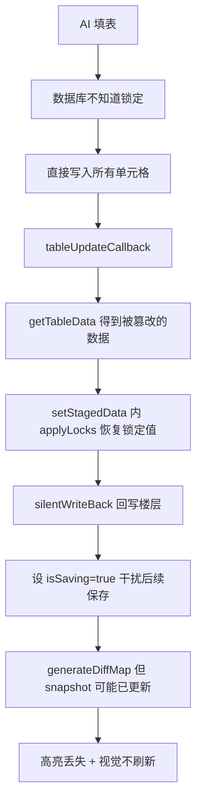
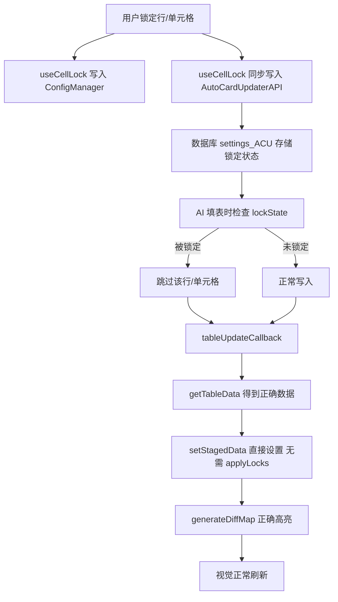

# 锁定系统改造计划：统一前端锁定与数据库后端锁定

## 一、问题根因

当前存在**两套完全独立的锁定系统**，互不通信：

| 对比 | 数据库后端锁 (mov3.1.js) | 前端锁 (useCellLock.ts) |
|------|---|---|
| **存储** | `settings_ACU.tableUpdateLocks[scopeKey][sheetKey]` | ConfigManager `chatConfig.cellLocks` |
| **索引方式** | 数字: `rowIndex`, `colIndex`, `"rowIndex:colIndex"` | 主键值: `"姓名=角色A"` |
| **生效时机** | AI 填表时**拦截写入** (行18530-18539) | 读取后**事后恢复** (`applyLocks`) |
| **API** | `AutoCardUpdaterAPI.lockTableRow(sheetKey, rowIndex)` | `useCellLock().toggleRowLock(tableName, rowKey, ...)` |

**问题**：前端 UI 切换锁定 → 只写 ConfigManager → AI 填表时数据库不知道 → 直接写入 → 前端 `applyLocks` 恢复 + `silentWriteBack` 回写 → **高亮丢失、视觉不刷新**。

## 二、解决方案

**核心思路**：前端锁定操作**同时写入数据库 API**，让后端在 AI 填表时原生拦截。保留前端 ConfigManager 存储（用于按主键恢复被删除行等高级功能），但**新增**数据库 API 同步层。

### 改造范围

```
修改文件:
  1. src/可视化表格/types.ts                    - 补充锁定 API 类型声明
  2. src/可视化表格/composables/useCellLock.ts   - 新增数据库 API 同步
  3. src/可视化表格/stores/useDataStore.ts       - 简化 setStagedData，移除 silentWriteBack
  4. src/可视化表格/composables/useApiCallbacks.ts - 移除 locksRestored 相关逻辑
  5. src/可视化表格/App.vue                      - 适配 setStagedData 返回类型
  6. src/可视化表格/composables/useAppDataActions.ts - 适配 setStagedData 返回类型

不修改:
  - .kilocode/mov3.1.js              - 数据库后端代码不动
  - components/DataCard.vue          - 锁定 UI 操作逻辑不变
  - components/DataTable.vue         - 锁定筛选逻辑不变
```

### 数据流改造前后对比

**改造前（有 bug）**：



**改造后（正确）**：



## 三、详细改造步骤

### 步骤 1：types.ts 补充锁定 API 类型

在 [`AutoCardUpdaterAPI`](src/可视化表格/types.ts:1155) 接口中添加：

```typescript
interface AutoCardUpdaterAPI {
  // ... 已有定义

  // 表格锁定 API
  getTableLockState?(sheetKey: string): {
    rows: number[];
    cols: number[];
    cells: string[];  // "rowIndex:colIndex" 格式
  } | null;

  setTableLockState?(
    sheetKey: string,
    lockState: { rows?: number[]; cols?: number[]; cells?: (string | [number, number])[] },
    options?: { merge?: boolean }
  ): boolean;

  clearTableLocks?(sheetKey: string): boolean;
  lockTableRow?(sheetKey: string, rowIndex: number, locked?: boolean): boolean;
  lockTableCell?(sheetKey: string, rowIndex: number, colIndex: number, locked?: boolean): boolean;
  toggleTableRowLock?(sheetKey: string, rowIndex: number): boolean;
  toggleTableCellLock?(sheetKey: string, rowIndex: number, colIndex: number): boolean;
}
```

### 步骤 2：useCellLock.ts 新增数据库同步层

**关键映射**：前端使用 `tableName`（如"重要人物表"），数据库使用 `sheetKey`（如"sheet_abc123"）。需要从 `stagedData` 中查找映射关系。

新增私有辅助函数：

```typescript
/** tableName → sheetKey 映射 */
function resolveSheetKey(tableName: string): string | null {
  const api = getCore().getDB();
  const tableData = api?.exportTableAsJson?.();
  if (!tableData) return null;
  for (const key in tableData) {
    if (key.startsWith('sheet_') && tableData[key]?.name === tableName) {
      return key;
    }
  }
  return null;
}

/** 在 savePendingLocks 结束后，同步到数据库 API */
function syncToDatabase(locks: LockStorage): void {
  const api = getCore().getDB();
  if (!api?.setTableLockState) {
    console.warn('[CellLock] 数据库锁定 API 不可用，仅保存到 ConfigManager');
    return;
  }

  const tableData = api.exportTableAsJson?.();
  if (!tableData) return;

  // 遍历所有表格，同步锁定状态
  for (const sheetKey in tableData) {
    if (!sheetKey.startsWith('sheet_')) continue;
    const tableName = tableData[sheetKey]?.name;
    if (!tableName) continue;

    const tableLocks = locks[tableName];
    if (!tableLocks || Object.keys(tableLocks).length === 0) {
      // 无锁定 → 清除数据库锁
      api.clearTableLocks(sheetKey);
      continue;
    }

    // 将前端主键锁定转换为数据库数字索引锁定
    const content = tableData[sheetKey]?.content;
    if (!content || content.length < 2) continue;

    const headers = content[0] as string[];
    const rowIndices: number[] = [];
    const cellKeys: string[] = [];

    for (const [rowKey, lock] of Object.entries(tableLocks)) {
      // 找到行在 content 中的数字索引
      const rowIndex = findRowIndexByKey(tableName, rowKey, content, headers);
      if (rowIndex === -1) continue;

      if (lock._fullRow) {
        rowIndices.push(rowIndex);
      } else {
        // 字段级锁定 → 转换为 "rowIndex:colIndex"
        for (const fieldName of Object.keys(lock._fields)) {
          const colIndex = headers.indexOf(fieldName);
          if (colIndex !== -1) {
            cellKeys.push(`${rowIndex}:${colIndex}`);
          }
        }
      }
    }

    // 完全替换该表的锁定状态
    api.setTableLockState(sheetKey, {
      rows: rowIndices,
      cols: [],  // 前端不支持列锁定
      cells: cellKeys,
    });
  }

  console.info('[CellLock] 锁定状态已同步到数据库 API');
}

/** 根据前端 rowKey 找到数据中的行索引 */
function findRowIndexByKey(
  tableName: string,
  rowKey: string,
  content: (string | number | null)[][],
  headers: string[]
): number {
  for (let i = 1; i < content.length; i++) {
    const key = getRowKey(tableName, content[i] as (string | null)[], headers, i - 1);
    if (key === rowKey) return i - 1;  // 返回数据行索引（0-based，不含表头）
  }
  return -1;
}
```

**修改 `savePendingLocks()`**：

```typescript
function savePendingLocks(): void {
  persistedLocks.value = JSON.parse(JSON.stringify(pendingLocks.value));
  saveLocks();                              // 保存到 ConfigManager（已有）
  syncToDatabase(persistedLocks.value);     // 新增：同步到数据库 API
}
```

**修改 `initPendingLocks()`** - 添加首次同步：

```typescript
function initPendingLocks(): void {
  loadLocks();
  pendingLocks.value = JSON.parse(JSON.stringify(persistedLocks.value));

  // 首次同步：如果 ConfigManager 有锁定数据，确保数据库也有
  if (Object.keys(persistedLocks.value).length > 0) {
    syncToDatabase(persistedLocks.value);
  }
}
```

### 步骤 3：useDataStore.ts 简化

#### 3a. `setStagedData()` (行462-489)

移除 `applyLocks` 调用，恢复为简单的数据设置。返回类型改回 `RawDatabaseData`：

```typescript
// 改造前
function setStagedData(data: RawDatabaseData): { data: RawDatabaseData; locksRestored: number } {
  const modifiedData = klona(data);
  let totalRestored = 0;
  for (const sheetId in modifiedData) {
    const sheet = modifiedData[sheetId];
    if (!sheet?.name || !sheet.content) continue;
    const result = cellLock.applyLocks(sheet.name, sheet.content);
    if (result.modified) totalRestored += result.restored.length;
  }
  stagedData.value = modifiedData;
  tables.value = processToTableData(modifiedData);
  return { data: modifiedData, locksRestored: totalRestored };
}

// 改造后
function setStagedData(data: RawDatabaseData): RawDatabaseData {
  const cloned = klona(data);
  stagedData.value = cloned;
  tables.value = processToTableData(cloned);
  console.info('[ACU] 暂存数据已设置');
  return cloned;
}
```

#### 3b. 删除 `silentWriteBack()` (行836-861)

完全移除此方法，从导出列表中也删除。

#### 3c. `loadFromDatabase()` (行583-646)

移除 `applyLocks` 相关代码（约行600-617），直接使用原始数据：

```typescript
// 改造前
const modifiedData = klona(rawData);
for (const sheetId in modifiedData) {
  const sheet = modifiedData[sheetId];
  if (!sheet?.name || !sheet.content) continue;
  const result = cellLock.applyLocks(sheet.name, sheet.content);
  // ...
}
stagedData.value = modifiedData;

// 改造后
const clonedData = klona(rawData);
stagedData.value = clonedData;
```

### 步骤 4：useApiCallbacks.ts 简化回调

**`tableUpdateCallback`** (行185-193)：

```typescript
// 改造前
const { data: processedData, locksRestored } = dataStore.setStagedData(newData);
if (locksRestored > 0) {
  console.info(`[ACU] 检测到 ${locksRestored} 个锁定值被恢复...`);
  dataStore.silentWriteBack(processedData).catch(err => { ... });
}
dataStore.generateDiffMap(processedData);

// 改造后
const processedData = dataStore.setStagedData(newData);
dataStore.generateDiffMap(processedData);
```

### 步骤 5：适配调用点

**App.vue** (行1115)：

```typescript
// 改造前
const { data: processedData } = dataStore.setStagedData(data);
dataStore.saveSnapshot(processedData);

// 改造后
const processedData = dataStore.setStagedData(data);
dataStore.saveSnapshot(processedData);
```

**useAppDataActions.ts** (行39 附近)：

```typescript
// 改造前
const { data: processedData } = dataStore.setStagedData(data);

// 改造后
const processedData = dataStore.setStagedData(data);
```

## 四、风险点和缓解方案

### 4.1 行索引漂移问题

数据库 API 使用**数字行索引**，当 AI 插入/删除行时索引会变化。前端使用主键值（如"姓名=角色A"）作为行标识，天然抗漂移。

**缓解**：`syncToDatabase()` 在每次 `savePendingLocks()` 时**重新计算**行索引映射，确保数据库中的索引与当前数据一致。

### 4.2 数据库 API 可能不可用

如果用户使用的 ACU 版本较旧，`setTableLockState` 等 API 可能不存在。

**缓解**：`syncToDatabase()` 中检查 `api?.setTableLockState`，不可用时降级为前端 `applyLocks` 恢复模式。具体实现：在 `setStagedData` 中保留一个可选的 fallback 路径。

### 4.3 锁定状态初始化

用户首次从旧版本升级时，ConfigManager 中有锁定数据但数据库中没有。

**缓解**：在 `initPendingLocks()` 中增加首次同步逻辑。

### 4.4 保留 ConfigManager 存储的必要性

即使数据库 API 处理了 AI 填表拦截，ConfigManager 存储仍然有价值：
- **主键索引**：数据库用数字索引，前端用主键值，行增删后数字索引会变
- **恢复被删除行**：`applyLocks` 中的 `rebuildRow` 功能需要完整的字段快照
- **UI 状态显示**：`pendingLocks` 用于批量编辑模式的即时反馈

## 五、改造顺序

| 序号 | 文件 | 改动内容 |
|------|------|---------|
| 1 | `types.ts` | 补充锁定 API 类型声明（无副作用） |
| 2 | `useCellLock.ts` | 添加 `syncToDatabase()` + `findRowIndexByKey()` + 修改 `savePendingLocks()` |
| 3 | `useDataStore.ts` | 简化 `setStagedData()` / `loadFromDatabase()`，移除 `silentWriteBack` |
| 4 | `useApiCallbacks.ts` | 简化回调，移除 locksRestored 逻辑 |
| 5 | `App.vue` + `useAppDataActions.ts` | 适配 `setStagedData` 返回类型 |
| 6 | 验证 | AI 填表后检查高亮和视觉刷新 |
