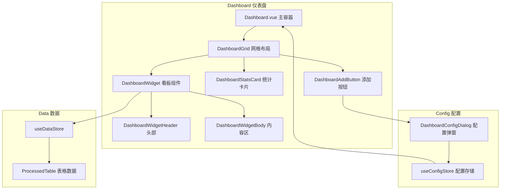

# 仪表盘重构计划

## 需求概述

将仪表盘重构为可自由配置的多功能区，支持：
1. **滚动小看板**：每个表都可变成提取特定标题的滚动看板（参考6.4.1的NPC/任务看板）
2. **自由配置**：每个表格都可以添加为看板
3. **表格统计**（暂定）：显示更新频率和未更新楼层数
4. **快捷按钮**：看板头右侧可配置快捷功能按钮（清除、撤回、手动更新、关系图等）

### 新增需求 (2025-01-14)

**1. 存储位置调整**
- 配置从「全局变量」改为「**聊天变量**」（绑定当前角色卡的聊天）
- 使用 `getVariables({ type: 'chat' })` 存取

**2. 顶栏入口**
- 仪表盘有自己的顶栏（和其他 Tab 风格一致）
- 顶栏包含「编辑」按钮，点击进入编辑态

**3. iOS 小组件编辑风格**
进入编辑态后，每个组件显示：
- **左上角 [×]**：移除组件
- **右上角 [+]**：配置快捷按钮
- **右下角 [⤡]**：拖动改变大小（单栏↔双栏）
- **拖动组件表头**：换组件位置
- **拖动组件行（此时行前面出现6点图标，按这里可以拖动）**：换组件行位置

大小规则：
- 单栏、双栏有固定宽度
- 双栏可拖成单栏，单栏可拖成双栏
- 双栏变单栏时，会把另一个双栏挤到下一行

**4. 滚动规则**
- **组件内部滚动**：组件内容超出时，组件内部可滚动（设置 `max-height` + `overflow-y: auto`）
- **仪表盘整体滚动**：当所有组件超出仪表盘高度时，仪表盘整体也可滚动

**5. 添加组件入口**
- 编辑态下，顶栏出现 **[+] 添加组件** 按钮
- 点击弹出选择表格弹窗

## 架构设计

### 1. 类型定义

在 `types.ts` 中新增：

```typescript
/** 看板快捷按钮类型 */
export type WidgetActionId =
  | 'goToTable'        // 跳转到表格
  | 'clear'            // 清除表格
  | 'undo'             // 撤回
  | 'manualUpdate'     // 手动更新
  | 'relationshipGraph' // 人物关系图
  | 'settings';        // 设置

/** 看板快捷按钮配置 */
export interface WidgetAction {
  id: WidgetActionId;
  icon: string;      // FA 图标 class
  label: string;     // 显示标签
  tooltip?: string;  // 悬浮提示
}

/** 单个看板配置 */
export interface DashboardWidgetConfig {
  /** 唯一 ID */
  id: string;
  /** 看板类型 */
  type: 'table' | 'stats' | 'custom';
  /** 关联的表格 ID (type='table' 时必填) */
  tableId?: string;
  /** 显示标题 */
  title: string;
  /** 图标 (FA class) */
  icon: string;
  /** 提取的列名列表 (空=显示全部) */
  displayColumns: string[];
  /** 最大显示行数 */
  maxRows: number;
  /** 快捷按钮列表 */
  actions: WidgetActionId[];
  /** 排序索引 */
  order: number;
  /** 是否启用 */
  enabled: boolean;
  /** 宽度权重 (1=单格, 2=双格) */
  colSpan: 1 | 2;
}

/** 仪表盘配置 */
export interface DashboardConfig {
  /** 看板列表 */
  widgets: DashboardWidgetConfig[];
  /** 布局模式 */
  layout: 'grid' | 'list';
  /** 列数 (grid 模式) */
  columns: number;
  /** 是否显示统计卡片 */
  showStats: boolean;
}
```

### 2. 预设快捷按钮

```typescript
export const WIDGET_ACTIONS: Record<WidgetActionId, WidgetAction> = {
  goToTable: { id: 'goToTable', icon: 'fa-external-link-alt', label: '跳转', tooltip: '跳转到表格' },
  clear: { id: 'clear', icon: 'fa-eraser', label: '清除', tooltip: '清除表格数据' },
  undo: { id: 'undo', icon: 'fa-undo', label: '撤回', tooltip: '撤回上次修改' },
  manualUpdate: { id: 'manualUpdate', icon: 'fa-hand-sparkles', label: '更新', tooltip: '手动更新' },
  relationshipGraph: { id: 'relationshipGraph', icon: 'fa-project-diagram', label: '关系图', tooltip: '人物关系图' },
  settings: { id: 'settings', icon: 'fa-cog', label: '设置', tooltip: '看板设置' },
};
```

### 3. 存储层设计

扩展 `useConfigStore.ts` 或新建 `useDashboardStore.ts`：

```typescript
// 存储键
const STORAGE_KEY_DASHBOARD = 'acu_dashboard_config_v1';

// 默认配置
export const DEFAULT_DASHBOARD_CONFIG: DashboardConfig = {
  widgets: [],
  layout: 'grid',
  columns: 2,
  showStats: true,
};

// 默认看板模板 (用于快速添加)
export const WIDGET_TEMPLATES: Record<string, Partial<DashboardWidgetConfig>> = {
  npc: {
    type: 'table',
    title: 'NPC',
    icon: 'fa-users',
    displayColumns: ['名称', '姓名', 'name', '状态', '好感度'],
    maxRows: 8,
    actions: ['goToTable', 'relationshipGraph'],
    colSpan: 1,
  },
  task: {
    type: 'table',
    title: '任务',
    icon: 'fa-tasks',
    displayColumns: ['名称', '任务名', '类型', '状态'],
    maxRows: 5,
    actions: ['goToTable'],
    colSpan: 1,
  },
  item: {
    type: 'table',
    title: '物品',
    icon: 'fa-box-open',
    displayColumns: ['名称', '物品名', '数量'],
    maxRows: 12,
    actions: ['goToTable', 'clear'],
    colSpan: 1,
  },
  character: {
    type: 'table',
    title: '主角',
    icon: 'fa-user',
    displayColumns: [],
    maxRows: 1,
    actions: ['goToTable'],
    colSpan: 2,
  },
};
```

---

## 组件设计

### 1. 组件结构

```
src/可视化表格/components/
├── Dashboard.vue                    # 仪表盘主容器 (重写)
├── dashboard/
│   ├── DashboardWidget.vue          # 通用看板组件
│   ├── DashboardWidgetHeader.vue    # 看板头部 (标题+快捷按钮)
│   ├── DashboardWidgetBody.vue      # 看板内容区 (滚动列表)
│   ├── DashboardStatsCard.vue       # 统计卡片
│   └── DashboardAddButton.vue       # 添加看板按钮
├── dialogs/
│   └── DashboardConfigDialog.vue    # 仪表盘配置弹窗 (新增)
```

### 2. Dashboard.vue (主容器)

```vue
<template>
  <div class="acu-dash-container">
    <!-- 统计卡片 (可选) -->
    <DashboardStatsCard v-if="showStats" />

    <!-- 看板网格 -->
    <div class="acu-dash-grid" :style="gridStyle">
      <DashboardWidget
        v-for="widget in enabledWidgets"
        :key="widget.id"
        :config="widget"
        :table="getTableData(widget.tableId)"
        @navigate="handleNavigate"
        @action="handleAction"
        @row-click="handleRowClick"
      />

      <!-- 添加看板按钮 -->
      <DashboardAddButton @click="openConfigDialog" />
    </div>
  </div>
</template>
```

### 3. DashboardWidget.vue (通用看板)

参考6.4.1样式，实现：
- 圆角卡片容器
- 可配置标题和图标
- 滚动列表展示
- 高亮变动项
- 点击跳转/预览

```vue
<template>
  <div class="acu-dash-card" :class="{ 'acu-dash-card-wide': config.colSpan === 2 }">
    <!-- 头部 -->
    <DashboardWidgetHeader
      :title="config.title"
      :icon="config.icon"
      :actions="config.actions"
      :count="displayRows.length"
      @action="handleAction"
    />

    <!-- 内容区 -->
    <div class="acu-dash-body" :class="bodyClass">
      <template v-if="config.type === 'table' && table">
        <!-- 网格式展示 (NPC风格) -->
        <div v-if="isGridStyle" class="acu-dash-npc-grid">
          <div
            v-for="row in displayRows"
            :key="row.key"
            class="acu-dash-npc-item acu-dash-interactive"
            :class="{ 'acu-highlight-changed': isRowChanged(row) }"
            @click="handleRowClick(row)"
          >
            {{ getDisplayValue(row) }}
          </div>
        </div>

        <!-- 列表式展示 (任务风格) -->
        <div v-else class="acu-dash-list">
          <div
            v-for="row in displayRows"
            :key="row.key"
            class="acu-dash-list-item acu-dash-interactive"
            :class="{ 'acu-highlight-changed': isRowChanged(row) }"
            @click="handleRowClick(row)"
          >
            <i :class="['fas', itemIcon]"></i>
            {{ getDisplayValue(row) }}
            <Badge v-if="getBadgeValue(row)" :value="getBadgeValue(row)" />
          </div>
        </div>
      </template>

      <!-- 空状态 -->
      <div v-else class="acu-dash-empty">
        <i :class="['fas', config.icon]"></i>
        <span>暂无数据</span>
      </div>
    </div>

    <!-- 查看更多 -->
    <button
      v-if="hasMore"
      class="acu-dash-more-btn"
      @click="handleNavigate"
    >
      查看全部 ({{ totalCount }})
    </button>
  </div>
</template>
```

### 4. DashboardWidgetHeader.vue (看板头部)

```vue
<template>
  <div class="acu-dash-title">
    <span class="acu-dash-title-text">
      <i :class="['fas', icon]"></i>
      {{ title }}
      <Badge v-if="count > 0" :value="String(count)" type="number" />
    </span>

    <!-- 快捷按钮区 -->
    <div class="acu-dash-actions">
      <button
        v-for="actionId in actions"
        :key="actionId"
        class="acu-dash-action-btn"
        :title="getActionTooltip(actionId)"
        @click.stop="$emit('action', actionId)"
      >
        <i :class="['fas', getActionIcon(actionId)]"></i>
      </button>
    </div>
  </div>
</template>
```

### 5. DashboardConfigDialog.vue (配置弹窗)

配置面板允许用户：
1. 选择要添加的表格
2. 配置显示列
3. 设置最大行数
4. 选择快捷按钮
5. 拖拽排序

---

## 样式设计 (参考6.4.1)

删除现有 `dashboard.scss`，重写为：

```scss
// =========================================
// Dashboard - 仪表盘 (重构版)
// =========================================

// 容器布局
.acu-dash-container {
  display: flex;
  flex-direction: column;
  gap: 16px;
  padding: 8px;
  height: 100%;
  overflow-y: auto;
  font-size: var(--acu-font-size);
  touch-action: pan-y;
}

// 网格布局
.acu-dash-grid {
  display: grid;
  grid-template-columns: repeat(var(--acu-dash-columns, 2), 1fr);
  gap: 16px;

  @media (max-width: 700px) {
    grid-template-columns: 1fr;
  }
}

// 看板卡片
.acu-dash-card {
  background: var(--acu-card-bg);
  border-radius: 12px;
  border: 1px solid var(--acu-border);
  padding: 16px;
  display: flex;
  flex-direction: column;
  gap: 12px;
  box-shadow: 0 4px 12px var(--acu-shadow);

  &.acu-dash-card-wide {
    grid-column: span 2;

    @media (max-width: 700px) {
      grid-column: span 1;
    }
  }
}

// 看板标题
.acu-dash-title {
  font-size: 1.2em;
  font-weight: bold;
  color: var(--acu-title-color);
  border-bottom: 1px dashed var(--acu-border);
  padding-bottom: 8px;
  display: flex;
  justify-content: space-between;
  align-items: center;

  .acu-dash-title-text {
    display: flex;
    align-items: center;
    gap: 8px;

    i {
      font-size: 0.9em;
    }
  }
}

// 快捷按钮区
.acu-dash-actions {
  display: flex;
  gap: 4px;
}

.acu-dash-action-btn {
  width: 28px;
  height: 28px;
  display: flex;
  align-items: center;
  justify-content: center;
  background: var(--acu-btn-bg);
  border: 1px solid transparent;
  border-radius: 6px;
  color: var(--acu-text-sub);
  cursor: pointer;
  transition: all 0.2s;

  &:hover {
    background: var(--acu-btn-hover);
    color: var(--acu-title-color);
    border-color: var(--acu-border);
  }
}

// NPC 网格
.acu-dash-npc-grid {
  display: grid;
  grid-template-columns: repeat(auto-fill, minmax(100px, 1fr));
  gap: 8px;
}

.acu-dash-npc-item {
  background: var(--acu-table-head);
  padding: 10px;
  border-radius: 8px;
  cursor: pointer;
  text-align: center;
  border: 1px solid transparent;
  transition: all 0.2s;
  font-weight: 500;
  white-space: nowrap;
  overflow: hidden;
  text-overflow: ellipsis;
  color: var(--acu-text-main);
  font-size: 1em;

  &:hover {
    border-color: var(--acu-highlight);
    color: var(--acu-highlight);
    background: var(--acu-btn-bg);
  }
}

// 列表项
.acu-dash-list {
  display: flex;
  flex-direction: column;
  gap: 5px;
}

.acu-dash-list-item {
  padding: 6px 0;
  border-bottom: 1px solid var(--acu-border);
  color: var(--acu-text-sub);
  font-size: 1em;
  display: flex;
  align-items: center;
  gap: 6px;
  cursor: pointer;

  &:last-child {
    border-bottom: none;
  }

  &:hover {
    color: var(--acu-text-main);
    padding-left: 4px;
  }

  i {
    font-size: 0.8em;
    color: var(--acu-highlight);
  }
}

// 交互状态
.acu-dash-interactive {
  cursor: pointer !important;
  position: relative;

  &:hover::after {
    content: '\f002';
    font-family: 'Font Awesome 6 Free';
    font-weight: 900;
    position: absolute;
    right: 5px;
    top: 50%;
    transform: translateY(-50%);
    opacity: 0.5;
    font-size: 10px;
  }
}

// 变动高亮
.acu-dash-npc-item.acu-highlight-changed,
.acu-dash-list-item.acu-highlight-changed {
  color: var(--acu-highlight) !important;
  background-color: var(--acu-highlight-bg);
  font-weight: bold;
  animation: pulse-highlight 2s infinite;
}

// 查看更多
.acu-dash-more-btn {
  display: block;
  width: 100%;
  padding: 8px;
  text-align: center;
  background: transparent;
  border: none;
  color: var(--acu-text-sub);
  cursor: pointer;
  font-size: 0.9em;
  transition: color 0.2s;

  &:hover {
    color: var(--acu-title-color);
  }
}

// 空状态
.acu-dash-empty {
  display: flex;
  flex-direction: column;
  align-items: center;
  justify-content: center;
  padding: 20px;
  color: var(--acu-text-sub);
  text-align: center;

  i {
    font-size: 24px;
    margin-bottom: 8px;
    opacity: 0.5;
  }
}

// 添加按钮
.acu-dash-add-btn {
  display: flex;
  align-items: center;
  justify-content: center;
  min-height: 120px;
  background: var(--acu-btn-bg);
  border: 2px dashed var(--acu-border);
  border-radius: 12px;
  cursor: pointer;
  transition: all 0.2s;
  color: var(--acu-text-sub);
  font-size: 24px;

  &:hover {
    border-color: var(--acu-title-color);
    color: var(--acu-title-color);
    background: var(--acu-table-hover);
  }
}
```

---

## 实现步骤与进度

### ✅ 已完成部分 (基础架构)

| 任务 | 文件 | 说明 |
|------|------|------|
| 类型定义 | `types.ts` | `DashboardWidgetConfig`, `WIDGET_ACTIONS`, `WIDGET_TEMPLATES` 等 |
| 存储层 | `useDashboardStore.ts` | 改为聊天变量存储，CRUD 操作 |
| 样式 | `dashboard.scss` | 基础样式 |
| 通用组件 | `DashboardWidget.vue` | 基础版本 |
| 主容器 | `Dashboard.vue` | 动态配置版本 |
| 编辑态 | Dashboard + Widget | 基础编辑控件 |
| 快捷按钮弹窗 | Dashboard.vue 内嵌 | 基础版本 |

---

### 🐛 BUG 修复清单 [待处理]

| # | 问题描述 | 影响文件 | 优先级 |
|---|----------|----------|--------|
| B1 | 移除"查看全部"按钮 - 右上角已有跳转快捷键 | `DashboardWidget.vue` | 高 |
| B2 | 编辑模式取消抖动动画 - 伤眼睛 | `dashboard.scss` | 高 |
| B3 | 组件右上+号点击后要弹出快捷图标配置弹窗 | `Dashboard.vue` | 高 |
| B4 | 仪表盘顶栏添加按钮无反应 | `Dashboard.vue` | 高 |
| B5 | 表头显示表ID而非表名 | `DashboardWidget.vue` | 高 |
| B6 | 物品栏不能滚动 | `dashboard.scss` / `DashboardWidget.vue` | 高 |
| B7 | 任务栏显示重复值（同一行两个任务名） | `DashboardWidget.vue` | 高 |
| B8 | PC拖动组件时滚轮不可用 | `Dashboard.vue` | 中 |

---

### 🆕 新功能需求 [待实现]

| # | 功能描述 | 影响文件 | 优先级 |
|---|----------|----------|--------|
| F1 | **仪表盘顶栏重构** - 布局：仪表盘标题 / (空) / 编辑图标 / 高度拖手 / 搜索框 | `Dashboard.vue` | 高 |
| F2 | **拖动排序改为拖顶栏** - 编辑态拖动组件顶栏换位 | `DashboardWidget.vue` | 高 |
| F3 | **移动端拖动滚动** - 识别拖动意图时滚动条跟随 | `Dashboard.vue` | 中 |
| F4 | **行末编辑按钮** - 点击打开可编辑卡片弹窗（复用历史记录样式） | `DashboardWidget.vue` + 新弹窗 | 中 |
| F5 | **PC悬浮快速预览** - 鼠标移到行上显示预览卡片 | `DashboardWidget.vue` | 中 |
| F6 | **组件顶栏设置按钮** - 每个表组件顶栏加设置图标 | `DashboardWidget.vue` | 低 |

---

### 📋 待实现任务明细

#### Phase A: BUG 修复

```
[ ] B1: 移除 DashboardWidget.vue 中的"查看全部"按钮
[ ] B2: 移除 dashboard.scss 中的 widget-wiggle 抖动动画
[ ] B3: 修复组件右上+号触发快捷按钮配置弹窗
[ ] B4: 修复仪表盘顶栏添加按钮事件绑定
[ ] B5: 修复表名显示 - 使用 table.name 而非 table.id
[ ] B6: 修复组件内容区滚动 (确保 max-height + overflow-y: auto)
[ ] B7: 修复任务栏重复显示 - getDisplayValue 逻辑
[ ] B8: 修复PC拖动时滚轮问题
```

#### Phase B: 顶栏重构

```
[ ] F1.1: 重构 Dashboard.vue 顶栏布局
      - 左侧: 仪表盘标题
      - 中间: flex-grow 占空
      - 右侧: 编辑图标 | 高度拖手 | 搜索框
[ ] F1.2: 集成搜索框组件
[ ] F1.3: 集成高度拖手功能
```

#### Phase C: 拖动排序优化

```
[ ] F2.1: 编辑态改为拖动组件顶栏区域换位
[ ] F2.2: 非编辑态禁用拖动
[ ] F3.1: 移动端拖动时滚动跟随
```

#### Phase D: 行交互增强

```
[ ] F4.1: 行末添加编辑按钮
[ ] F4.2: 创建行编辑弹窗 (复用历史记录弹窗样式)
[ ] F5.1: PC端鼠标悬浮行时显示快速预览
```

#### Phase E: 组件设置

```
[ ] F6.1: 组件顶栏添加设置按钮
[ ] F6.2: 设置按钮功能待定 (预留接口)
```

---

## 待确认事项

1. **表格统计数据来源**：更新频率和未更新楼层数如何从数据库获取？
   - 需要确认 `AutoCardUpdaterAPI` 是否提供相关接口
   - 如无现成接口，此功能暂时搁置

2. ~~**配置存储位置**~~：✅ 已确定
   - 使用酒馆全局变量 (`getVariables({ type: 'global' })`)
   - 存储在 `acu_dashboard_config` 键下

3. ~~**预设模板行为**~~：✅ 已实现
   - `TABLE_KEYWORD_RULES` 定义关键词匹配规则
   - 添加看板时自动匹配模板

---

## 当前文件状态

| 文件 | 状态 | 说明 |
|------|------|------|
| `types.ts` | ✅ 完成 | 类型定义 (行 588-720+) |
| `useDashboardStore.ts` | 🔄 需修改 | Store 实现 - 需改为聊天变量存储 |
| `dashboard.scss` | ✅ 完成 | 样式文件 (356 行) |
| `Dashboard.vue` | 🔄 需重构 | 硬编码版，需改为动态配置 |
| `DashboardWidget.vue` | ❌ 待创建 | 通用看板组件 |
| `WidgetActionsDialog.vue` | ❌ 待创建 | 快捷按钮配置弹窗 |
| `AddWidgetDialog.vue` | ❌ 待创建 | 添加组件弹窗 |

---

## 详细实现规格

### 1. useDashboardStore.ts 修改

**当前代码位置**: `src/可视化表格/stores/useDashboardStore.ts`

**修改内容**:
```typescript
// 旧代码 (行 63-64, 84-85)
const vars = getVariables({ type: 'global' });
replaceVariables({ ...currentVars, acu_dashboard_config: config.value }, { type: 'global' });

// 新代码
const vars = getVariables({ type: 'chat' });
replaceVariables({ ...currentVars, acu_dashboard_config: config.value }, { type: 'chat' });
```

### 2. DashboardWidget.vue 组件规格

**文件路径**: `src/可视化表格/components/dashboard/DashboardWidget.vue`

**Props**:
```typescript
interface Props {
  config: DashboardWidgetConfig;  // 看板配置
  tableData: ProcessedTable | null;  // 表格数据
  isEditing: boolean;  // 是否处于编辑态
  diffMap: Set<string>;  // 变更行集合
}
```

**Emits**:
```typescript
const emit = defineEmits<{
  'navigate': [tableId: string];  // 跳转到表格
  'row-click': [tableId: string, row: TableRow];  // 点击行
  'action': [actionId: WidgetActionId, tableId: string];  // 快捷按钮
  'remove': [widgetId: string];  // 移除组件
  'resize': [widgetId: string, colSpan: 1 | 2];  // 改变大小
  'config-actions': [widgetId: string];  // 配置快捷按钮
}>();
```

**模板结构**:
```vue
<template>
  <div class="acu-dash-widget" :class="{
    'acu-dash-widget-wide': config.colSpan === 2,
    'acu-dash-widget-editing': isEditing
  }">
    <!-- 编辑控件 (仅编辑态显示) -->
    <template v-if="isEditing">
      <button class="acu-widget-remove" @click.stop="emit('remove', config.id)">×</button>
      <button class="acu-widget-config" @click.stop="emit('config-actions', config.id)">+</button>
      <div class="acu-widget-resize" @mousedown="startResize">⤡</div>
    </template>

    <!-- 头部 -->
    <div class="acu-dash-title">
      <span class="acu-dash-title-text">
        <i :class="['fas', config.icon]"></i>
        {{ config.title }}
        <Badge v-if="rowCount > 0" :value="String(rowCount)" />
      </span>
      <div class="acu-dash-actions">
        <button v-for="actionId in config.actions" ...>
      </div>
    </div>

    <!-- 内容区 (可滚动) -->
    <div class="acu-dash-body" :style="{ maxHeight: bodyMaxHeight }">
      <!-- grid/list/compact 三种显示风格 -->
    </div>

    <!-- 查看更多 -->
    <button v-if="hasMore" class="acu-dash-more-btn" @click="emit('navigate', config.tableId)">
      查看全部 ({{ totalCount }})
    </button>
  </div>
</template>
```

### 3. Dashboard.vue 重构规格

**模板结构**:
```vue
<template>
  <div class="acu-dash-container">
    <!-- 顶栏 -->
    <div class="acu-dash-header">
      <span class="acu-dash-header-title">仪表盘</span>
      <div class="acu-dash-header-actions">
        <template v-if="isEditing">
          <button class="acu-dash-add-widget-btn" @click.stop="showAddDialog = true">
            <i class="fas fa-plus"></i> 添加
          </button>
          <button class="acu-dash-done-btn" @click.stop="isEditing = false">完成</button>
        </template>
        <template v-else>
          <button class="acu-dash-edit-btn" @click.stop="isEditing = true">编辑</button>
        </template>
      </div>
    </div>

    <!-- 组件网格 (可整体滚动) -->
    <div class="acu-dash-grid" ref="gridRef">
      <DashboardWidget
        v-for="widget in enabledWidgets"
        :key="widget.id"
        :config="widget"
        :table-data="getTableData(widget.tableId)"
        :is-editing="isEditing"
        :diff-map="diffMap"
        @navigate="handleNavigate"
        @row-click="handleRowClick"
        @action="handleAction"
        @remove="handleRemove"
        @resize="handleResize"
        @config-actions="showActionsDialog"
      />
    </div>

    <!-- 弹窗 -->
    <AddWidgetDialog v-if="showAddDialog" @close="showAddDialog = false" @add="handleAddWidget" />
    <WidgetActionsDialog v-if="editingWidgetId" ... />
  </div>
</template>
```

### 4. 样式规格补充 (dashboard.scss)

需要新增的样式:
```scss
// 顶栏
.acu-dash-header {
  display: flex;
  justify-content: space-between;
  align-items: center;
  padding: 12px 16px;
  border-bottom: 1px solid var(--acu-border);
  background: var(--acu-bg-nav);
}

// 编辑态组件
.acu-dash-widget-editing {
  position: relative;
  border: 2px dashed var(--acu-title-color);
  animation: widget-wiggle 0.3s ease-in-out infinite;
}

// 编辑控件
.acu-widget-remove {
  position: absolute;
  top: -10px;
  left: -10px;
  width: 24px;
  height: 24px;
  border-radius: 50%;
  background: var(--acu-danger, #e74c3c);
  color: white;
  border: none;
  cursor: pointer;
  z-index: 10;
}

.acu-widget-config {
  position: absolute;
  top: -10px;
  right: -10px;
  // 类似 remove 样式
}

.acu-widget-resize {
  position: absolute;
  bottom: -10px;
  right: -10px;
  width: 24px;
  height: 24px;
  cursor: nwse-resize;
  // 拖动手柄样式
}

// 组件内容区滚动
.acu-dash-body {
  max-height: 200px;  // 可配置
  overflow-y: auto;
  overflow-x: hidden;
}

// 网格整体滚动
.acu-dash-grid {
  flex: 1;
  overflow-y: auto;
  display: grid;
  grid-template-columns: repeat(2, 1fr);
  gap: 16px;
  padding: 16px;
}

// iOS 小组件抖动动画
@keyframes widget-wiggle {
  0%, 100% { transform: rotate(-0.5deg); }
  50% { transform: rotate(0.5deg); }
}
```

### 5. 交互流程图

```
用户进入仪表盘
    │
    ├─→ 普通态: 显示所有组件，可正常交互
    │       │
    │       └─→ 点击[编辑]按钮
    │               │
    │               ▼
    └─→ 编辑态: 组件显示编辑控件，开始抖动
            │
            ├─→ 点击[×]: 移除组件
            │       └─→ 调用 dashboardStore.removeWidget(id)
            │
            ├─→ 点击[+]: 打开快捷按钮配置弹窗
            │       └─→ 选择后调用 dashboardStore.setWidgetActions(id, actions)
            │
            ├─→ 拖动[⤡]: 改变大小
            │       └─→ 单栏↔双栏切换，调用 dashboardStore.updateWidget(id, {colSpan})
            │
            ├─→ 拖动整体: 换位置
            │       └─→ 调用 dashboardStore.moveWidget(id, newOrder)
            │
            ├─→ 点击顶栏[+添加]: 打开添加组件弹窗
            │       └─→ 选择表格后调用 dashboardStore.addWidget(tableId)
            │
            └─→ 点击[完成]: 退出编辑态
                    └─→ isEditing = false
```

---

## Mermaid 架构图



```mermaid
flowchart LR
    subgraph Actions 快捷按钮
        A1[goToTable 跳转]
        A2[clear 清除]
        A3[undo 撤回]
        A4[manualUpdate 更新]
        A5[relationshipGraph 关系图]
    end

    DH[WidgetHeader] --> A1
    DH --> A2
    DH --> A3
    DH --> A4
    DH --> A5

    A1 --> MainPanel[切换Tab]
    A2 --> PurgeDialog[清除弹窗]
    A3 --> HistoryDialog[历史记录]
    A4 --> ManualUpdateDialog[手动更新弹窗]
    A5 --> RelationshipGraph[关系图组件]
