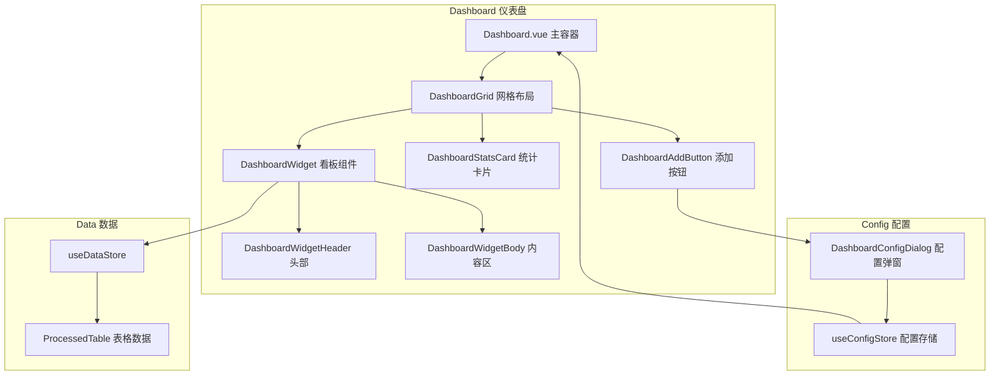

# 仪表盘重构计划

## 需求概述

将仪表盘重构为可自由配置的多功能区，支持：
1. **滚动小看板**：每个表都可变成提取特定标题的滚动看板
2. **自由配置**：每个表格都可以添加为看板
3. **表格统计**（暂定）：显示更新频率和未更新楼层数
4. **快捷按钮**：看板头右侧可配置快捷功能按钮（清除、撤回、手动更新、关系图等）

### 新增需求 (2025-01-14)

**1. 存储位置调整**
- 配置从「全局变量」改为「**聊天变量**」（绑定当前角色卡的聊天）
- 使用 `getVariables({ type: 'chat' })` 存取

**2. 顶栏入口**
- 仪表盘有自己的顶栏（和其他 Tab 风格一致）
- 顶栏包含「编辑」按钮，点击进入仪表盘编辑态（可增、排）

**3. iOS 小组件编辑风格**
进入编辑态后，每个组件显示：
- **左上角 [×]**：移除组件
- **右上角 [+]**：配置快捷按钮
- **右下角 [⤡]**：拖动改变大小（单栏↔双栏）
- **拖动组件**：换组件位置

大小规则：
- 单栏、双栏有固定宽度
- 双栏可拖成单栏，单栏可拖成双栏
- 双栏变单栏时，会把另一个双栏挤到下一行

**4. 滚动规则**
- **组件内部滚动**：组件内容超出时，组件内部可滚动（设置 `max-height` + `overflow-y: auto`）
- **仪表盘整体滚动**：当所有组件超出仪表盘高度时，仪表盘整体也可滚动

**5. 添加组件入口**
- 编辑态下，顶栏出现 **[+] 添加组件** 按钮
- 点击弹出选择表格弹窗

## 架构设计

### 1. 类型定义

在 `types.ts` 中新增：

```typescript
/** 看板快捷按钮类型 */
export type WidgetActionId =
  | 'clear'            // 清除表格
  | 'undo'             // 撤回
  | 'manualUpdate'     // 手动更新
  | 'relationshipGraph' // 人物关系图
  | 'settings';        // 设置

/** 看板快捷按钮配置 */
export interface WidgetAction {
  id: WidgetActionId;
  icon: string;      // FA 图标 class
  label: string;     // 显示标签
  tooltip?: string;  // 悬浮提示
}

/** 单个看板配置 */
export interface DashboardWidgetConfig {
  /** 唯一 ID */
  id: string;
  /** 看板类型 */
  type: 'table' | 'stats' | 'custom';
  /** 关联的表格 ID (type='table' 时必填) */
  tableId?: string;
  /** 显示标题 */
  title: string;
  /** 图标 (FA class) */
  icon: string;
  /** 提取的列名列表 (空=显示全部) */
  displayColumns: string[];
  /** 最大显示行数 */
  maxRows: number;
  /** 快捷按钮列表 */
  actions: WidgetActionId[];
  /** 排序索引 */
  order: number;
  /** 是否启用 */
  enabled: boolean;
  /** 宽度权重 (1=单格, 2=双格) */
  colSpan: 1 | 2;
}

/** 仪表盘配置 */
export interface DashboardConfig {
  /** 看板列表 */
  widgets: DashboardWidgetConfig[];
  /** 布局模式 */
  layout: 'grid' | 'list';
  /** 列数 (grid 模式) */
  columns: number;
  /** 是否显示统计卡片 */
  showStats: boolean;
}
```

### 2. 预设快捷按钮

```typescript
export const WIDGET_ACTIONS: Record<WidgetActionId, WidgetAction> = {
  clear: { id: 'clear', icon: 'fa-eraser', label: '清除', tooltip: '清除表格数据' },
  undo: { id: 'undo', icon: 'fa-undo', label: '撤回', tooltip: '撤回上次修改' },
  manualUpdate: { id: 'manualUpdate', icon: 'fa-hand-sparkles', label: '更新', tooltip: '手动更新' },
  relationshipGraph: { id: 'relationshipGraph', icon: 'fa-project-diagram', label: '关系图', tooltip: '人物关系图' },
  settings: { id: 'settings', icon: 'fa-cog', label: '设置', tooltip: '看板设置' },
};
```

### 3. 存储层设计

扩展 `useConfigStore.ts` 或新建 `useDashboardStore.ts`：

```typescript
// 存储键
const STORAGE_KEY_DASHBOARD = 'acu_dashboard_config_v1';


---

## 组件设计

### 1. 组件结构

```
src/可视化表格/components/
├── Dashboard.vue                    # 仪表盘主容器 (重写)
├── dashboard/
│   ├── DashboardWidget.vue          # 通用看板组件
│   ├── DashboardWidgetHeader.vue    # 看板头部 (标题+快捷按钮)
│   ├── DashboardWidgetBody.vue      # 看板内容区 (滚动列表)
│   ├── DashboardStatsCard.vue       # 统计卡片
│   └── DashboardAddButton.vue       # 添加看板按钮
├── dialogs/
│   └── DashboardConfigDialog.vue    # 仪表盘配置弹窗 (新增)
```

### 5. DashboardConfigDialog.vue (配置弹窗)

配置面板允许用户：
1. 选择要添加的表格
2. 配置显示列
4. 配置组件右上快捷按钮
5. 拖拽排序


---

## 实现步骤与进度

### ✅ 已完成部分 (基础架构)

| 任务 | 文件 | 说明 |
|------|------|------|
| 类型定义 | `types.ts` | `DashboardWidgetConfig`, `WIDGET_ACTIONS`, `WIDGET_TEMPLATES` 等 |
| 存储层 | `useDashboardStore.ts` | 改为聊天变量存储，CRUD 操作 |
| 样式 | `dashboard.scss` | 基础样式 |
| 通用组件 | `DashboardWidget.vue` | 基础版本 |
| 主容器 | `Dashboard.vue` | 动态配置版本 |
| 编辑态 | Dashboard + Widget | 基础编辑控件 |
| 快捷按钮弹窗 | Dashboard.vue 内嵌 | 基础版本 |

---

### 🐛 BUG 修复清单 [待处理]

| # | 问题描述 | 影响文件 | 优先级 |
|---|----------|----------|--------|


---

### 🆕 新功能需求 [待实现]

| # | 功能描述 | 影响文件 | 优先级 |
|---|----------|----------|--------|
| F5 | **PC悬浮快速预览** - 鼠标移到行上显示预览卡片 | `DashboardWidget.vue` | 中 |
| F7 | **顶栏点击跳转** - 删除 goToTable 按钮，点击顶栏非按钮区域跳转 | `DashboardWidget.vue` | 高 |
| F8 | **组件设置弹窗** - 配置行标题列、展示标签列、互动标签列 | 新建 `WidgetSettingsDialog.vue` | 高 |
| F9 | **展示标签** - 从指定列提取值，作为徽章展示在行编辑按钮左侧 | `DashboardWidget.vue` | 高 |
| F10 | **互动标签系统** - 标签匹配+提示词模板+通配符 | `DashboardWidget.vue`, `useCoreActions.ts`, 新增 `interactiveTagDefaults.ts` | 高 |

---

### 📋 待实现任务明细

#### Phase C: 拖动排序优化（暂停）

```
[ ] F2.2: 非编辑态禁用拖动
[ ] F3.1: 移动端拖动时滚动跟随
```

#### Phase D: 行交互增强

```
[ ] F5.1: PC端鼠标悬浮行时显示快速预览
```

#### Phase E: 顶栏与导航优化

```
[ ] F7.1: 删除 goToTable 快捷按钮（从 actions 列表中移除）
[ ] F7.2: 点击组件顶栏非按钮区域跳转到对应表格
[ ] F7.3: 顶栏区域添加 cursor: pointer 样式
```

#### Phase F: 组件设置与标签系统 🆕

```
[ ] F8.1: 新增 WidgetSettingsDialog.vue 弹窗组件
[ ] F8.2: 扩展 DashboardWidgetConfig 类型，添加：
         - titleColumn: string             // 行标题列名（留空=默认第一列）
         - displayTagColumns: string[]     // 展示标签来源列名列表
         - interactiveTagConfig: {
             sourceColumns: string[]       // 标签来源列（解析后匹配已定义标签）
             tagDefinitions: Array<{       // 标签定义库（存在酒馆）
               label: string               // 标签文本
               promptTemplate: string      // 提示词模板（支持通配符）
               isFixed: boolean            // 是否固定显示（无论是否从列匹配到）
             }>
           }
[ ] F8.3: 设置弹窗 UI 设计 - 三个配置区块：
         - 行标题配置：下拉选择列
         - 展示标签配置：多选列（复选框列表）
         - 互动标签配置：
           a) 列选择（多选）+ 提示词模板输入框
           b) 固定标签列表（可增删，每项含标签文本+提示词）
[ ] F8.4: 设置按钮显示逻辑修正：
         - 普通状态：设置按钮可见可点击（在 actions 快捷按钮区）
         - 编辑态：右上角只有 [+] 按钮（配置快捷按钮），设置按钮隐藏
[ ] F9.1: DashboardWidget 渲染逻辑 - 展示标签
         - 在行编辑按钮左侧渲染徽章
         - 徽章样式使用 .acu-badge 类
         - 纯展示，点击无效果
[ ] F10.1: 互动标签渲染逻辑
         - 徽章样式 + hover 效果
         - 分隔符检测 [,，；;|/]，拆分后匹配已定义标签
         - 固定标签 (isFixed=true) 始终显示
         - 只显示匹配到已定义标签的内容
[ ] F10.2: 提示词模板通配符系统
         支持的通配符：
         - {{value}} - 标签本身的值
         - {{rowTitle}} - 当前行标题值（从 titleColumn 获取）
         - {{playerName}} - 主角名（调用酒馆接口获取）
         - {{tableName}} - 表格名称
[ ] F10.3: 点击逻辑
         - 解析模板，替换通配符
         - 使用 setInput() 追加到酒馆输入框
[ ] F10.4: 标签定义管理 UI（设置弹窗）
         - 添加标签定义按钮
         - 每项可编辑：标签文本 + 提示词模板 + 是否固定
         - 支持删除
[ ] F10.5: 默认标签提示词预设（预留）
         - 新建 interactiveTagDefaults.ts
         - 定义常用标签的默认提示词映射
         - 例如: { "调情": "<request:{{playerName}}和{{rowTitle}}调情>", ... }
         - 用户未自定义时使用默认值
[ ] F10.6: 更新 useDashboardStore 的 addWidget/updateWidget 方法
```

---

## 待确认事项

1. **表格统计数据来源**：更新频率和未更新楼层数如何从数据库获取？
   - 需要确认 `AutoCardUpdaterAPI` 是否提供相关接口
   - 如无现成接口，此功能暂时搁置

2. ~~**配置存储位置**~~：✅ 已确定
   - 使用酒馆聊天变量

3. ~~**预设模板行为**~~：✅ 已实现
   - `TABLE_KEYWORD_RULES` 定义关键词匹配规则
   - 添加看板时自动匹配模板

---

## 当前文件状态

| 文件 | 状态 | 说明 |
|------|------|------|


---

## 详细实现规格

### 1. useDashboardStore.ts 修改

**当前代码位置**: `src/可视化表格/stores/useDashboardStore.ts`


### 2. DashboardWidget.vue 组件规格

**文件路径**: `src/可视化表格/components/dashboard/DashboardWidget.vue`

**Props**:
```typescript
interface Props {
  config: DashboardWidgetConfig;  // 看板配置
  tableData: ProcessedTable | null;  // 表格数据
  isEditing: boolean;  // 是否处于编辑态
  diffMap: Set<string>;  // 变更行集合
}
```

**Emits**:
```typescript
const emit = defineEmits<{
  'navigate': [tableId: string];  // 跳转到表格
  'row-click': [tableId: string, row: TableRow];  // 点击行
  'action': [actionId: WidgetActionId, tableId: string];  // 快捷按钮
  'remove': [widgetId: string];  // 移除组件
  'resize': [widgetId: string, colSpan: 1 | 2];  // 改变大小
  'config-actions': [widgetId: string];  // 配置快捷按钮
}>();
```

**模板结构**:
```vue
<template>
  <div class="acu-dash-widget" :class="{
    'acu-dash-widget-wide': config.colSpan === 2,
    'acu-dash-widget-editing': isEditing
  }">
    <!-- 编辑控件 (仅编辑态显示) -->
    <template v-if="isEditing">
      <button class="acu-widget-remove" @click.stop="emit('remove', config.id)">×</button>
      <button class="acu-widget-config" @click.stop="emit('config-actions', config.id)">+</button>
      <div class="acu-widget-resize" @mousedown="startResize">⤡</div>
    </template>

    <!-- 头部 -->
    <div class="acu-dash-title">
      <span class="acu-dash-title-text">
        <i :class="['fas', config.icon]"></i>
        {{ config.title }}
        <Badge v-if="rowCount > 0" :value="String(rowCount)" />
      </span>
      <div class="acu-dash-actions">
        <button v-for="actionId in config.actions" ...>
      </div>
    </div>

    <!-- 内容区 (可滚动) -->
    <div class="acu-dash-body" :style="{ maxHeight: bodyMaxHeight }">
      <!-- grid/list/compact 三种显示风格 -->
    </div>

    <!-- 查看更多 -->
    <button v-if="hasMore" class="acu-dash-more-btn" @click="emit('navigate', config.tableId)">
      查看全部 ({{ totalCount }})
    </button>
  </div>
</template>
```

### 3. Dashboard.vue 重构规格
<template>
  <div class="acu-dash-container">
    <!-- 顶栏 -->
    <div class="acu-dash-header">
      <span class="acu-dash-header-title">仪表盘</span>
      <div class="acu-dash-header-actions">
        <template v-if="isEditing">
          <button class="acu-dash-add-widget-btn" @click.stop="showAddDialog = true">
            <i class="fas fa-plus"></i> 添加
          </button>
          <button class="acu-dash-done-btn" @click.stop="isEditing = false">完成</button>
        </template>
        <template v-else>
          <button class="acu-dash-edit-btn" @click.stop="isEditing = true">编辑</button>
        </template>
      </div>
    </div>

    <!-- 组件网格 (可整体滚动) -->
    <div class="acu-dash-grid" ref="gridRef">
      <DashboardWidget
        v-for="widget in enabledWidgets"
        :key="widget.id"
        :config="widget"
        :table-data="getTableData(widget.tableId)"
        :is-editing="isEditing"
        :diff-map="diffMap"
        @navigate="handleNavigate"
        @row-click="handleRowClick"
        @action="handleAction"
        @remove="handleRemove"
        @resize="handleResize"
        @config-actions="showActionsDialog"
      />
    </div>

    <!-- 弹窗 -->
    <AddWidgetDialog v-if="showAddDialog" @close="showAddDialog = false" @add="handleAddWidget" />
    <WidgetActionsDialog v-if="editingWidgetId" ... />
  </div>
</template>
```

### 4. 样式规格补充 (dashboard.scss)

需要新增的样式:

// 顶栏
.acu-dash-header {
  display: flex;
  justify-content: space-between;
  align-items: center;
  padding: 12px 16px;
  border-bottom: 1px solid var(--acu-border);
  background: var(--acu-bg-nav);
}

// 编辑态组件
.acu-dash-widget-editing {
  position: relative;
  border: 2px dashed var(--acu-title-color);
  animation: widget-wiggle 0.3s ease-in-out infinite;
}

// 编辑控件
.acu-widget-remove {
  position: absolute;
  top: -10px;
  left: -10px;
  width: 24px;
  height: 24px;
  border-radius: 50%;
  background: var(--acu-danger, #e74c3c);
  color: white;
  border: none;
  cursor: pointer;
  z-index: 10;
}

.acu-widget-config {
  position: absolute;
  top: -10px;
  right: -10px;
  // 类似 remove 样式
}

.acu-widget-resize {
  position: absolute;
  bottom: -10px;
  right: -10px;
  width: 24px;
  height: 24px;
  cursor: nwse-resize;
  // 拖动手柄样式
}

// 组件内容区滚动
.acu-dash-body {
  max-height: 200px;  // 可配置
  overflow-y: auto;
  overflow-x: hidden;
}

// 网格整体滚动
.acu-dash-grid {
  flex: 1;
  overflow-y: auto;
  display: grid;
  grid-template-columns: repeat(2, 1fr);
  gap: 16px;
  padding: 16px;
}

// iOS 小组件抖动动画
@keyframes widget-wiggle {
  0%, 100% { transform: rotate(-0.5deg); }
  50% { transform: rotate(0.5deg); }
}
```

### 5. 交互流程图

```
用户进入仪表盘
    │
    ├─→ 普通态: 显示所有组件，可正常交互
    │       │
    │       └─→ 点击[编辑]按钮
    │               │
    │               ▼
    └─→ 编辑态: 组件显示编辑控件，开始抖动
            │
            ├─→ 点击[×]: 移除组件
            │       └─→ 调用 dashboardStore.removeWidget(id)
            │
            ├─→ 点击[+]: 打开快捷按钮配置弹窗
            │       └─→ 选择后调用 dashboardStore.setWidgetActions(id, actions)
            │
            ├─→ 拖动[⤡]: 改变大小
            │       └─→ 单栏↔双栏切换，调用 dashboardStore.updateWidget(id, {colSpan})
            │
            ├─→ 拖动整体: 换位置
            │       └─→ 调用 dashboardStore.moveWidget(id, newOrder)
            │
            ├─→ 点击顶栏[+添加]: 打开添加组件弹窗
            │       └─→ 选择表格后调用 dashboardStore.addWidget(tableId)
            │
            └─→ 点击[完成]: 退出编辑态
                    └─→ isEditing = false
```

---

## Mermaid 架构图



```mermaid
flowchart LR
    subgraph Actions 快捷按钮
        A1[goToTable 跳转]
        A2[clear 清除]
        A3[undo 撤回]
        A4[manualUpdate 更新]
        A5[relationshipGraph 关系图]
    end

    DH[WidgetHeader] --> A1
    DH --> A2
    DH --> A3
    DH --> A4
    DH --> A5

    A1 --> MainPanel[切换Tab]
    A2 --> PurgeDialog[清除弹窗]
    A3 --> HistoryDialog[历史记录]
    A4 --> ManualUpdateDialog[手动更新弹窗]
    A5 --> RelationshipGraph[关系图组件]
