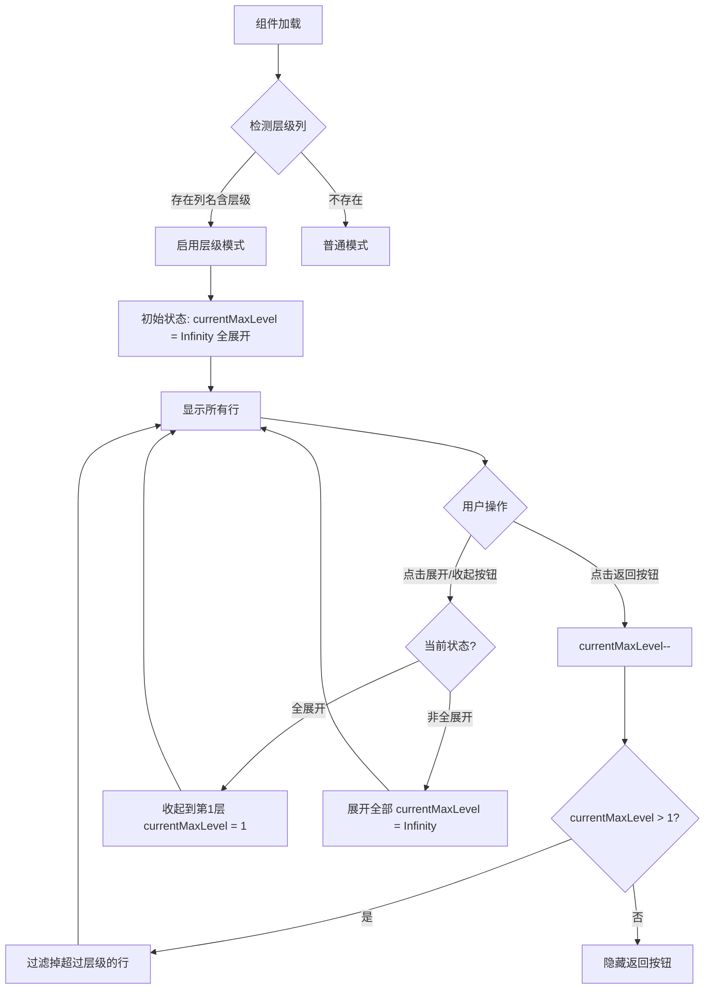

# 地点表层级显示功能计划

## 需求概述

为仪表盘的 List 模式组件添加层级显示功能，专门针对地点表等包含层级数据的表格。

## 核心功能

### 1. 层级检测
- **检测条件**：表格中存在列名包含"层级"两个字
- **数据格式**：该列的值使用 `/` 分隔层级，如 `城市/街道/商店`
- **层级解析**：`城市/街道/商店` 解析为 3 级：
  - 第 1 级：城市
  - 第 2 级：城市/街道
  - 第 3 级：城市/街道/商店

### 2. List 模式行为
- **初始状态**：全部展开，显示所有层级的行
- **无视觉缩进**：所有行平级显示

### 3. 两个控制按钮（放在标题栏右侧）

#### 3.1 返回按钮 (fa-arrow-left)
- **功能**：点击返回上一层级（隐藏当前最大层级的行）
- **可见条件**：当前不是只显示第 1 层级时显示
- **逻辑**：
  - 点击 → `currentMaxLevel--`
  - 可多次点击，直到只剩第 1 层级

#### 3.2 展开/收起按钮 (fa-expand-alt / fa-compress-alt)
- **功能**：在全展开和全收起之间切换
- **图标切换**：
  - 全展开状态：显示 `fa-compress-alt`（点击收起）
  - 非全展开状态：显示 `fa-expand-alt`（点击展开）
- **逻辑**：
  - 全展开时点击 → 收起到第 1 层级
  - 非全展开时点击 → 展开到全部层级

### 4. 行点击行为
- 保持原有行为：点击行打开编辑弹窗
- 不做层级展开/收起的交互（由按钮统一控制）

## 技术实现

### 状态管理

```typescript
// 在 DashboardWidget.vue 中添加

/** 检测层级列名 */
const hierarchyColumn = computed(() => {
  if (!props.tableData) return null;
  return props.tableData.headers.find(h => h.includes('层级'));
});

/** 是否启用层级模式 */
const isHierarchyMode = computed(() => !!hierarchyColumn.value);

/** 当前显示的最大层级（初始为最大值，即全部展开） */
const currentMaxLevel = ref(Infinity);

/** 计算数据中的最大层级深度 */
const maxLevelInData = computed(() => {
  if (!isHierarchyMode.value || !props.tableData) return 1;
  let maxLevel = 1;
  for (const row of props.tableData.rows) {
    const level = getRowLevel(row);
    if (level > maxLevel) maxLevel = level;
  }
  return maxLevel;
});

/** 是否处于全展开状态 */
const isFullyExpanded = computed(() => {
  return currentMaxLevel.value >= maxLevelInData.value;
});

/** 解析行的层级深度 */
function getRowLevel(row: TableRow): number {
  if (!hierarchyColumn.value) return 1;
  const cell = row.cells.find(c => c.key === hierarchyColumn.value);
  if (!cell?.value) return 1;
  const path = String(cell.value);
  // 计算 / 的数量 + 1 = 层级深度
  return (path.match(/\//g) || []).length + 1;
}

/** 返回上一层级 */
function goBackLevel(): void {
  if (currentMaxLevel.value > 1) {
    // 如果是 Infinity，先设为实际最大层级 - 1
    if (currentMaxLevel.value === Infinity || currentMaxLevel.value > maxLevelInData.value) {
      currentMaxLevel.value = maxLevelInData.value - 1;
    } else {
      currentMaxLevel.value--;
    }
  }
}

/** 切换展开/收起状态 */
function toggleExpandCollapse(): void {
  if (isFullyExpanded.value) {
    // 全展开 → 收起到第 1 层
    currentMaxLevel.value = 1;
  } else {
    // 非全展开 → 展开到全部
    currentMaxLevel.value = Infinity;
  }
}

/** 是否可以返回（当前不是只显示第 1 层） */
const canGoBack = computed(() => {
  return currentMaxLevel.value > 1;
});

/** 是否显示返回按钮 */
const showBackButton = computed(() => {
  return isHierarchyMode.value && canGoBack.value;
});

/** 是否显示展开/收起按钮（层级模式下始终显示） */
const showExpandCollapseButton = computed(() => {
  return isHierarchyMode.value && maxLevelInData.value > 1;
});
```

### 过滤逻辑修改

```typescript
// 修改 displayRows 计算属性，加入层级过滤

const displayRows = computed(() => {
  if (!props.tableData) return [];

  let rows = [...props.tableData.rows];

  // 搜索模式：过滤不匹配的行
  if (props.searchTerm) {
    rows = rows.filter(row => isRowMatchSearch(row));
  }

  // 层级模式：过滤超过当前最大层级的行
  if (isHierarchyMode.value && currentMaxLevel.value !== Infinity) {
    rows = rows.filter(row => getRowLevel(row) <= currentMaxLevel.value);
  }

  // 排序：AI 更新的排前面
  return rows.sort((a, b) => {
    const aAi = isRowAiChanged(a);
    const bAi = isRowAiChanged(b);
    if (aAi !== bAi) return bAi ? 1 : -1;
    return a.index - b.index;
  });
});
```

### 模板修改

```vue
<!-- 在标题栏的按钮区域添加两个层级控制按钮 -->
<div class="acu-dash-actions">
  <!-- 返回按钮（层级模式，非第1层时显示） -->
  <button
    v-if="showBackButton"
    class="acu-icon-btn"
    title="返回上一层级"
    @click.stop="goBackLevel"
  >
    <i class="fas fa-arrow-left"></i>
  </button>

  <!-- 展开/收起按钮（层级模式下显示） -->
  <button
    v-if="showExpandCollapseButton"
    class="acu-icon-btn"
    :title="isFullyExpanded ? '收起到第一层' : '展开全部层级'"
    @click.stop="toggleExpandCollapse"
  >
    <i :class="['fas', isFullyExpanded ? 'fa-compress-alt' : 'fa-expand-alt']"></i>
  </button>

  <!-- 设置按钮常驻 -->
  <button
    v-if="config.type !== 'updateStatus'"
    class="acu-icon-btn"
    :title="getActionTooltip('settings')"
    @click.stop="handleAction('settings')"
  >
    <i class="fas fa-cog"></i>
  </button>

  <!-- 其他配置的快捷按钮... -->
</div>
```

## 流程图



## 按钮状态表

| 状态 | 返回按钮 | 展开/收起按钮图标 | 展开/收起按钮功能 |
|------|----------|-------------------|-------------------|
| 全展开（初始） | 显示 | fa-compress-alt | 收起到第1层 |
| 部分展开 | 显示 | fa-expand-alt | 展开全部 |
| 只显示第1层 | 隐藏 | fa-expand-alt | 展开全部 |

## 边界情况处理

1. **表格无层级列**：保持原有行为，不显示两个按钮
2. **层级列值为空**：视为第 1 层级
3. **所有行都是第 1 层级**：不显示两个按钮
4. **搜索模式**：层级过滤与搜索过滤同时生效
5. **表格数据更新**：保持当前层级状态，除非数据结构变化

## 文件修改清单

| 文件 | 修改内容 |
|------|----------|
| `src/可视化表格/components/dashboard/DashboardWidget.vue` | 添加层级检测、返回按钮、展开/收起按钮、过滤逻辑 |

## 不需要修改的内容

- 无需修改 `types.ts`（不需要新类型）
- 无需修改 Store（状态在组件内部管理）
- 无需修改样式（复用现有 `.acu-icon-btn`）
- 无需修改 Grid 模式
