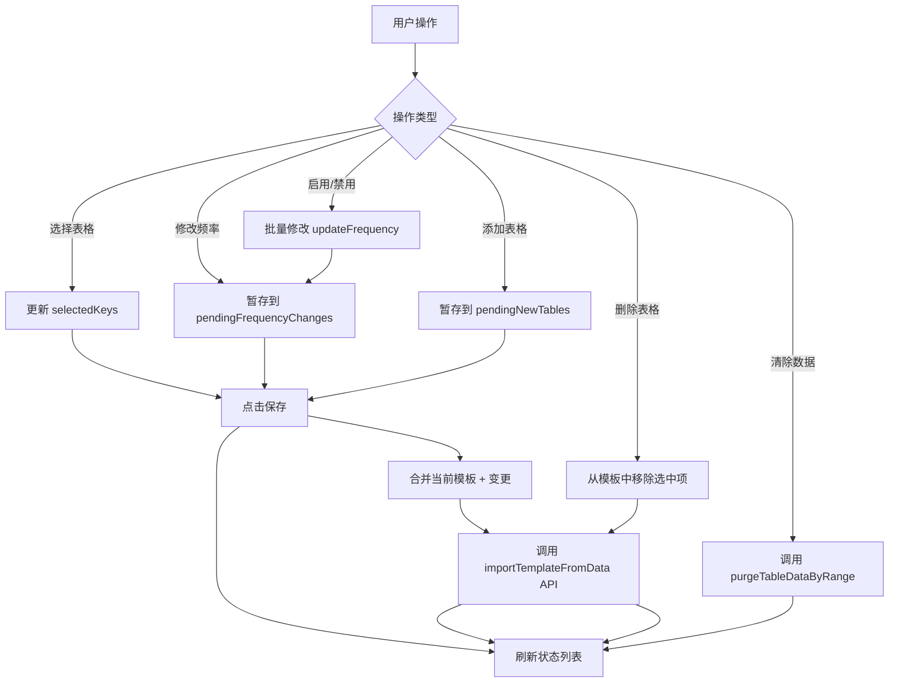

# 表格状态看板增强计划

## 1. 需求概述

将 `TableStatusBoard` 组件从只读的状态展示面板升级为**可编辑的表格管理中心**，支持：

- 批量选择表格
- 批量启用/禁用自动更新
- 批量清除指定表格数据
- 批量删除表格
- 添加新表格（JSON 粘贴/文件导入）
- 导出选中表格模板
- 直接编辑更新频率

## 2. 交互设计

### 2.1 模式切换

```
┌─────────────────────────────────────────────────────────┐
│  共 5 个表格 · AI楼层 42        [刷新] [✏️编辑]         │  ← 普通模式
├─────────────────────────────────────────────────────────┤
│  共 5 个表格 · AI楼层 42                                │
│  [全选] [导出] [删除] [添加] [清除] [禁用]  [刷新] [✓]  │  ← 编辑模式
└─────────────────────────────────────────────────────────┘
```

### 2.2 编辑模式行为

1. **进入编辑模式**：点击编辑按钮 → toastr 提示"可多选操作" → 按钮变为 ✓（保存）
2. **选择表格**：点击行即选中/取消，选中行整行高亮（使用 `--acu-title-color` 背景）
3. **更新频率**：编辑模式下该列变为 `<input type="number">`，可直接修改
4. **退出编辑模式**：点击 ✓ 保存 → 批量提交所有变更 → 恢复普通模式

### 2.3 工具栏按钮逻辑

| 按钮 | 图标 | 逻辑 |
|------|------|------|
| **全选** | `fa-check-double` | 切换全选/全不选 |
| **导出** | `fa-download` | 导出选中表格的模板 JSON |
| **删除** | `fa-trash` | 删除选中表格（需二次确认） |
| **添加** | `fa-plus` | 打开添加表格弹窗 |
| **清除** | `fa-eraser` | 打开范围清除弹窗（复用高级清除逻辑） |
| **禁用/启用** | `fa-ban` / `fa-play` | 智能切换：<br>- 全是禁用 → 显示"启用"<br>- 全是启用 → 显示"禁用"<br>- 混合状态 → 禁止点击 |

## 3. 技术架构

### 3.1 组件结构

```
TableStatusBoard.vue (增强版)
├── 状态管理
│   ├── isEditing: boolean                    # 编辑模式开关
│   ├── selectedKeys: Set<string>             # 选中的表格 key
│   ├── pendingFrequencyChanges: Map<string, number>  # 待保存的频率变更
│   └── pendingNewTables: SheetTemplate[]     # 待添加的新表格
│
├── UI 渲染
│   ├── Header (统计信息 + 工具栏)
│   ├── Table (可选中、可编辑频率)
│   └── Footer (编辑模式提示)
│
└── 弹窗
    ├── AddTableDialog.vue       # 新增：添加表格弹窗
    └── 复用 AdvancedPurgeDialog # 高级清除
```

### 3.2 数据流



### 3.3 API 调用

| 功能 | API | 来源 |
|------|-----|------|
| 获取当前模板 | `getTableTemplate()` | `AutoCardUpdaterAPI` |
| 保存模板变更 | `importTemplateFromData(data)` | `AutoCardUpdaterAPI` |
| 高级清除 | `purgeTableDataByRange(keys, start, end)` | `useDataPersistence` |
| 刷新状态 | `refresh()` | `useTableUpdateStatus` |

## 4. 文件改动清单

### 4.1 新增文件

| 文件路径 | 说明 |
|----------|------|
| `components/dialogs/common/AddTableDialog.vue` | 添加表格弹窗 |
| `styles/overlays/dialogs-add-table.scss` | 添加表格弹窗样式 |

### 4.2 修改文件

| 文件路径 | 改动说明 |
|----------|----------|
| `components/dashboard/TableStatusBoard.vue` | 核心改造：增加编辑模式、多选、工具栏 |
| `composables/useTableUpdateStatus.ts` | 新增：`updateTableFrequency()`、`deleteTable()` 方法 |
| `styles/components/dashboard.scss` | 新增：编辑模式高亮、工具栏样式 |
| `styles/index.scss` | 导入新增样式文件 |

## 5. 详细实现步骤

### 步骤 1: 增强 TableStatusBoard.vue 状态管理

```typescript
// 新增状态
const isEditing = ref(false);
const selectedKeys = ref<Set<string>>(new Set());
const pendingFrequencyChanges = ref<Map<string, number>>(new Map());
const pendingNewTables = ref<SheetTemplate[]>([]);

// 计算属性：禁用/启用按钮状态
const toggleButtonState = computed(() => {
  if (selectedKeys.value.size === 0) return 'disabled';

  const selectedItems = statusList.value.filter(s => selectedKeys.value.has(s.sheetKey));
  const allDisabled = selectedItems.every(s => s.effectiveFrequency === 0);
  const allEnabled = selectedItems.every(s => s.effectiveFrequency !== 0);

  if (allDisabled) return 'enable';   // 全是禁用 → 显示"启用"按钮
  if (allEnabled) return 'disable';   // 全是启用 → 显示"禁用"按钮
  return 'mixed';                      // 混合状态 → 禁止操作
});
```

### 步骤 2: 改造表格行渲染

```vue
<tr
  v-for="item in sortedStatusList"
  :key="item.sheetKey"
  :class="{
    'acu-row-selected': isEditing && selectedKeys.has(item.sheetKey),
    'acu-highlight-ai': hasTableAiChanges(item.name)
  }"
  @click="isEditing ? toggleSelect(item.sheetKey) : handleTableClick(item)"
>
  <!-- 表格名称 -->
  <td>{{ item.name }}</td>

  <!-- 更新频率：编辑模式下变为输入框 -->
  <td>
    <template v-if="isEditing">
      <input
        type="number"
        :value="getEditingFrequency(item)"
        min="-1"
        class="acu-freq-input"
        @input="handleFrequencyChange(item.sheetKey, $event)"
        @click.stop
      />
    </template>
    <template v-else>
      <!-- 原有的显示逻辑 -->
    </template>
  </td>

  <!-- 其他列保持不变 -->
</tr>
```

### 步骤 3: 实现工具栏

```vue
<!-- 编辑模式工具栏 -->
<div v-if="isEditing" class="acu-status-toolbar">
  <button class="acu-tool-btn" @click.stop="toggleSelectAll" title="全选">
    <i class="fas fa-check-double"></i>
  </button>
  <button class="acu-tool-btn" @click.stop="handleExport" :disabled="selectedKeys.size === 0" title="导出">
    <i class="fas fa-download"></i>
  </button>
  <button class="acu-tool-btn" @click.stop="handleDelete" :disabled="selectedKeys.size === 0" title="删除">
    <i class="fas fa-trash"></i>
  </button>
  <button class="acu-tool-btn" @click.stop="showAddDialog = true" title="添加">
    <i class="fas fa-plus"></i>
  </button>
  <button class="acu-tool-btn" @click.stop="showPurgeDialog = true" :disabled="selectedKeys.size === 0" title="清除">
    <i class="fas fa-eraser"></i>
  </button>
  <button
    class="acu-tool-btn"
    @click.stop="handleToggleEnabled"
    :disabled="toggleButtonState === 'mixed' || selectedKeys.size === 0"
    :title="toggleButtonState === 'enable' ? '启用' : '禁用'"
  >
    <i :class="['fas', toggleButtonState === 'enable' ? 'fa-play' : 'fa-ban']"></i>
  </button>
</div>
```

### 步骤 4: 实现保存逻辑

```typescript
async function handleSave() {
  if (!isEditing.value) return;

  const api = getCore().getDB();
  if (!api?.getTableTemplate || !api?.importTemplateFromData) {
    toast.error('数据库 API 不可用');
    return;
  }

  // 1. 获取当前模板
  const template = api.getTableTemplate();
  if (!template) {
    toast.error('无法获取当前模板');
    return;
  }

  // 2. 应用频率变更
  for (const [sheetKey, newFreq] of pendingFrequencyChanges.value) {
    if (template[sheetKey]?.updateConfig) {
      template[sheetKey].updateConfig.updateFrequency = newFreq;
    }
  }

  // 3. 添加新表格
  for (const newTable of pendingNewTables.value) {
    const newKey = `sheet_${newTable.uid || Date.now()}`;
    template[newKey] = newTable;
  }

  // 4. 调用 API 保存
  const result = await api.importTemplateFromData(template);

  if (result.success) {
    toast.success('保存成功');
    // 清理状态
    pendingFrequencyChanges.value.clear();
    pendingNewTables.value = [];
    selectedKeys.value.clear();
    isEditing.value = false;
    // 刷新列表
    await refresh();
  } else {
    toast.error(`保存失败: ${result.message}`);
  }
}
```

### 步骤 5: 实现添加表格弹窗

```vue
<!-- AddTableDialog.vue 核心结构 -->
<template>
  <div class="acu-modal-container" v-if="visible">
    <div class="acu-modal acu-add-table-modal">
      <div class="acu-modal-header">
        <span class="acu-modal-title">添加表格</span>
        <button class="acu-close-pill" @click="handleClose">取消</button>
      </div>

      <div class="acu-modal-body">
        <!-- Tab 切换：粘贴 JSON / 导入文件 -->
        <div class="acu-add-table-tabs">
          <button :class="{ active: mode === 'paste' }" @click="mode = 'paste'">
            粘贴 JSON
          </button>
          <button :class="{ active: mode === 'file' }" @click="mode = 'file'">
            导入文件
          </button>
        </div>

        <!-- 粘贴模式 -->
        <div v-if="mode === 'paste'" class="acu-add-table-paste">
          <textarea
            v-model="jsonInput"
            placeholder="粘贴表格模板 JSON..."
            class="acu-textarea-scrollable"
          ></textarea>
          <button class="acu-modal-btn primary" @click="parseJson">解析</button>
        </div>

        <!-- 文件导入模式 -->
        <div v-else class="acu-add-table-file">
          <input type="file" accept=".json" @change="handleFileSelect" />
        </div>

        <!-- 解析结果：表格选择列表 -->
        <div v-if="parsedTables.length > 0" class="acu-add-table-list">
          <div class="acu-settings-title">选择要添加的表格</div>
          <SwitchList
            v-model="selectedTableKeys"
            :items="parsedTableItems"
            empty-text="暂无可添加的表格"
          />
        </div>
      </div>

      <div class="acu-modal-footer">
        <button class="acu-modal-btn secondary" @click="handleClose">取消</button>
        <button
          class="acu-modal-btn primary"
          :disabled="selectedTableKeys.length === 0"
          @click="handleConfirm"
        >
          添加 ({{ selectedTableKeys.length }})
        </button>
      </div>
    </div>
  </div>
</template>
```

### 步骤 6: 样式增强

```scss
// styles/components/dashboard.scss 新增

// 编辑模式选中行高亮
.acu-status-table tbody tr.acu-row-selected {
  background: var(--acu-title-color-bg) !important;

  td {
    color: var(--acu-title-color);
  }
}

// 编辑模式工具栏
.acu-status-toolbar {
  display: flex;
  gap: 4px;
  margin-right: 8px;

  .acu-tool-btn {
    padding: 4px 8px;
    font-size: 12px;

    &:disabled {
      opacity: 0.4;
      cursor: not-allowed;
    }
  }
}

// 频率输入框
.acu-freq-input {
  width: 60px;
  padding: 4px 6px;
  text-align: center;
  font-size: 13px;
  border: 1px solid var(--acu-border);
  border-radius: 4px;
  background: var(--acu-btn-bg);
  color: var(--acu-text-main);

  &:focus {
    outline: none;
    border-color: var(--acu-title-color);
  }

  // 隐藏 spinner
  &::-webkit-inner-spin-button,
  &::-webkit-outer-spin-button {
    -webkit-appearance: none;
    margin: 0;
  }
}
```

## 6. 模板数据结构参考

```typescript
interface SheetTemplate {
  uid: string;
  name: string;
  sourceData: {
    note: string;
    initNode: string;
    deleteNode: string;
    updateNode: string;
    insertNode: string;
  };
  content: (string | number | null)[][];  // 表头行 + 数据行
  updateConfig: {
    uiSentinel: number;      // -1
    contextDepth: number;    // -1 = 沿用全局
    updateFrequency: number; // -1 = 沿用全局, 0 = 禁用, >0 = 具体频率
    batchSize: number;       // -1
    skipFloors: number;      // -1
  };
  exportConfig: {
    enabled: boolean;
    splitByRow: boolean;
    entryName: string;
    entryType: string;
    keywords: string;
    preventRecursion: boolean;
    injectionTemplate: string;
  };
  orderNo: number;
}

interface TemplateData {
  mate: {
    type: 'chatSheets';
    version: 1;
    updateConfigUiSentinel: -1;
  };
  [sheetKey: `sheet_${string}`]: SheetTemplate;
}
```

## 7. 测试用例

### 7.1 基础流程

1. **进入编辑模式**：点击编辑按钮 → 出现 toastr → 按钮变为 ✓
2. **多选表格**：点击多行 → 行高亮
3. **修改频率**：修改输入框数值
4. **保存**：点击 ✓ → 数据持久化 → 列表刷新

### 7.2 边界情况

1. 未选中任何表格时，导出/删除/清除/禁用按钮应禁用
2. 选中混合状态（有启用有禁用）时，禁用/启用按钮应禁用
3. 添加表格解析失败时，显示错误提示
4. 保存 API 调用失败时，保持编辑状态不退出

## 8. 风险与注意事项

1. **保存性能**：`importTemplateFromData` 是全量覆盖，数据量大时可能较慢
2. **并发冲突**：保存时需检查是否有其他地方正在修改模板
3. **向后兼容**：确保生成的模板结构符合数据库 API 要求（必须包含 `mate` 字段）
4. **样式隔离**：新增样式需使用 `acu-` 前缀避免与酒馆样式冲突
